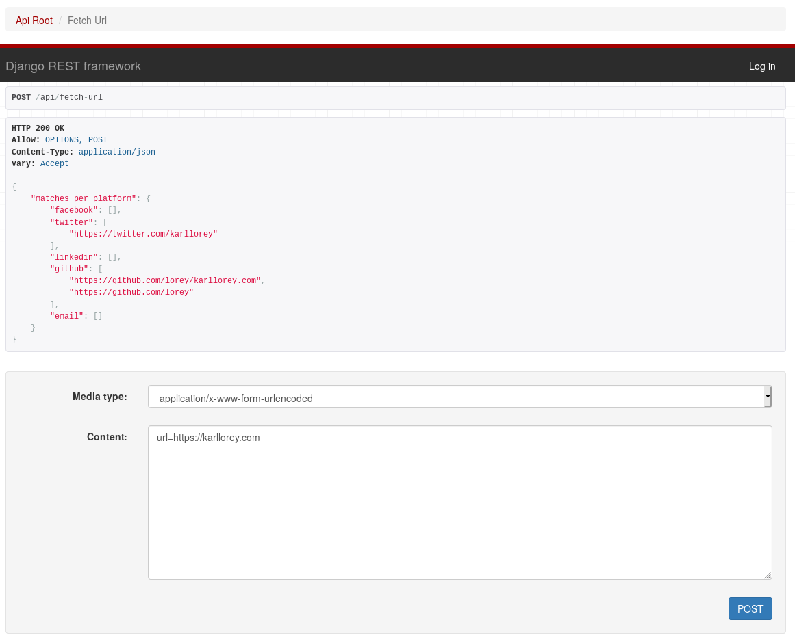

# Notes. David Gleba

https://github.com/lorey/socials-api/issues/4

```
---------- Forwarded message ---------
From: Karl Lorey <notifications@github.com>
Date: Wed, May 6, 2020 at 6:23 AM
Subject: [realpython/dockerizing-django] Absolute URLs without port (#66)
To: realpython/dockerizing-django <dockerizing-django@noreply.github.com>
Cc: Subscribed <subscribed@noreply.github.com>

So I used this to build a dockerized API with Django Rest Framework. Since I develop several projects at once, I use a different port for local development. Turns out that Django
was not able to produce the right absolute URLs in the browsable API. Instead of localhost:12345/api, I only got localhost/api.
What I tried:
setting USE_X_FORWARDED_FOR_HOST and USE_X_FORWARDED_FOR_PORT to True, see https://docs.djangoproject.com/en/3.0/ref/settings/#use-x-forwarded-host
Anyway, what fixed it for me was using $http_host instead of $host in the nginx config.
server {
listen 80;
# server_name localhost;
charset utf-8;
location /static {
alias /usr/share/nginx/static;
}
location / {
proxy_pass http://web:8000;
proxy_set_header Host $http_host; # $host is without port, $http_host works
proxy_set_header X-Real-IP $remote_addr;
proxy_set_header X-Forwarded-For $proxy_add_x_forwarded_for;
}
}
My issue: lorey/socials-api#4
My configuration: https://github.com/lorey/socials-api/tree/d7f0bca4df5be9c662ede96aac6ae89d17890404
Hope this helps anyone. Let me know if someone finds a better solution or can explain this.
—
You are receiving this because you are subscribed to this thread.
Reply to this email directly, view it on GitHub, or unsubscribe.


```

# socials API: extract social media profiles
The [socials API](http://socials.karllorey.com) allows you to extract social media profiles from urls.
It is an API version of my library called [socials for Python](https://github.com/lorey/socials).

Try it at [socials.karllorey.com](http://socials.karllorey.com).

## Example
Requesting `http://socials.karllorey.com/api/fetch-url` 
with a POST request and `url=https://karllorey.com` as parameter 
will return all social media profiles 
linked from [karllorey.com](https://karllorey.com) (my personal website):

```json
{
    "matches_per_platform": {
        "facebook": [],
        "twitter": [
            "https://twitter.com/karllorey"
        ],
        "linkedin": [],
        "github": [
            "https://github.com/lorey/karllorey.com",
            "https://github.com/lorey"
        ],
        "email": []
    }
}
```

## Test it (with the provided web interface)
1. Go to [socials.karllorey.com/api/fetch-url](http://socials.karllorey.com/api/fetch-url)
2. Select for `Media type`: `application/x-www-form-urlencoded`
3. Enter in `Content`: `url=https://karllorey.com` or any other url



## Set it up for yourself
socials API is dockerized and can be set up via docker-compose within seconds:
```bash
docker-compose build
docker-compose up -f docker-compose.yml -f docker-compose.prod.yml -d
```

It should now be accessible at port 80.
The development version you get with `docker-compose up` is at port 8016.
Make sure to adapt the [rate limit in `socials_api/settings.py`](socials_api/settings.py).

I have personal ansible and terraform files for deployment via docker-compose on AWS.
Reach out if you're interested.

# References
- [socials](https://github.com/lorey/socials), a Python library to check if urls are social media profiles
- [social-media-profiles-regexs](https://github.com/lorey/social-media-profiles-regexs):
  extract urls of social media profiles with regular expressions
